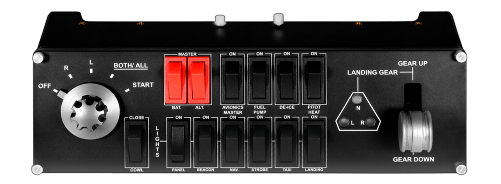

# MSFS2020 Saitek Panel Support

This application was made to enable using a Saitek Switch Flight Panel with Microsoft Flight Simulator 2020 

# Download and Run

For those wishing to just run 

- Download the repo to your machine
- Locate the **SaitekPanelMSFS2020/SaitekPanel** folder
- Launch MSFS2020  and begin a flight
- Ensure your Saitek Switch Flight Panel is plugged in 
- Run the **SaitekSwitchPanel.exe**
- Close by exiting bash window/console 
# Coming Soon 
- Map switches to different events 
***Note*** All switches do work, but only for their intended action.
`Supported Switches Currently: 
MASTER_BAT ,
	MASTER_ALT,
	AVIONICS_MASTER ,
	FUEL_PUMP ,
	DE_ICE ,
	LANDING_GEAR ,
	PITOT_HEAT ,
	MAG_LEFT ,
	MAG_RIGHT ,
	MAG_OFF ,
	MAG_START ,
	MAG_ALL ,
	COWL_FLAP  ,
	LIGHT_PANEL ,
	LIGHT_BEACON ,
	LIGHT_NAV ,
	LIGHT_STROBE,
	LIGHT_TAXI ,
	LIGHT_LANDING
`
# Build and Run
### Requirments 
- [Windows Development Kit 10 ](https://developer.microsoft.com/en-us/windows/downloads/windows-10-sdk/) **not included**
- [MSFS2020 SDK](https://fs2020.surclaro.com/msfs2020-sdk-is-here-start-developing-fs2020-add-ons/) **good for examples, not needed**
- SimConnect DLL/LIB (Include with MSFS2020 SDK) **included in repo**
- [hidapi](https://github.com/signal11/hidapi) **included in repo**
- [Visual Studio](https://docs.microsoft.com/en-us/visualstudio/install/install-visual-studio?view=vs-2019) **not included**

For those wishing to build and add on features 
- Download the repo
- Open  **MSFS2020Panel.sln** with Visual Studio 
- Build and run 

